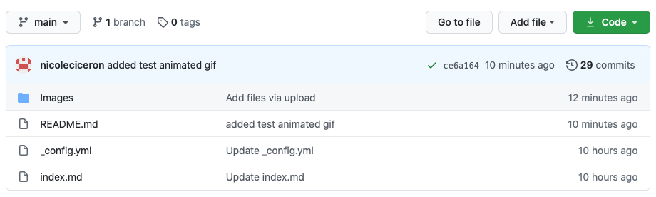

## Learn the fundamentals of Tech Comm as you learn how to host your own Online Resume on GitHub Pages

This README will show you on hosting a resume on GitHub pages in a very simple way. The practical steps in this tutorial also relate to Andrew Etter's book _Modern Technical Writing_ where you can learn about about the fundamtals of Techincal Communication especially creating good documentation.  

## Table of Contents
- [Overview](#audience)
- [Prerequisites](#prerequisites)
- [Steps](#instructions)
- [FAQs](#faqs)
- [More Resources](#more-resources)
- [Authors and Acknowledgments](#authors-and-acknowledgments)

## Overview
[add gif overview]

 > Hosting your resume in a static website is a very simple and portable process. It is always a good idea to host a website because documentations always will always get outdated. It gives you the power to fix any inaccuracies and keep all your content up to date instantly while also making sure that your content has also good quality. GitHub has now made it very easy for users to host static websites through GitHub pages. Using MarkDown, a popular markup language, for formatting your web content along with a site generator such as Jekyll results in a really easy and straighforward process in hosting a static website on GitHub Pages. 

 > This tutorial is an exmaple of a basic functional documentation that is memtioned in Andrew Etter's book. 

## Prerequisites
For this tutorial, you will need two things: 
1) **a Github account.** If you do not have a GitHub account, you would need to make one by going to this link [https://github.com](https://github.com). This tutorial will use the web version of GitHub. 
    > GitHub is very popular Distributed Version Control Systems(DVCS). It has a user-friendly interface  that allows for isolated work and has overall good performance in software development. 
    
2) **a resume formatted in Markdown**. Your resume will need to be formatted in Markdown. If you are not yet familiar with MarkDown, I highly suggest you try and learn it. It is a very simple lightweight markup language that you can learn in just a few minutes. A good tutorial on Markdown can be found below this page. 
    > You would also need a MarkDown Editor for this step. There are a lot of available editors that you can use depending on the opearting system you are using. One good editor is [dillinger.io](https://dillinger.io). 

## Steps

1. First, create a new repository from your GitHub profile. 
    > A repository is a directory where where your files related to your project will be stored. reposritories can either be stored locally or in this case, it would be stored online in GitHub.
    
    

2. Inside your repository, add the files **README.md** and **index.md**. 
    > The README file will just contain descriptions on what your page is about. For this tutuorial, this file will just conatin a description telling that your site is a sttic website displaying your resume. You can include the process on how you did the process of hosting your site, just like this tutorial. 
        

    > Next, The index file will contain the content you want to be displayed on your static website. In this case, your page will contain your resume that was formatted in Markdown. 

    

3. You can now view your page by going to the link: _your-usesrname.gitub.io_. You can also do this by going to **Settings** You can continue editing your **index.md** file if you want to make any more changes in the formatting of your content.

4. You can also add themes on your page using Jekyll templates. Jekyll is a very popular static site generator that easy displays and processes your content, which is formatted in a lightweight markup language, in a working static website without any databases or any installations. There are a handful of [Jekyll themes](https://pages.github.com/themes/) that are supported by GitHub pages that you can use for your own statci website.

    > Adding themes through Jekyll will automatically adds another file in your repository named _config.yml. This file will just contain the name of the theme that you would have chosen.

    4.1 Go to your repository's page. On the main tabs, click on **Settings**
    
    4.2 You will be directed to the **Options** tab inside Settings. Scroll down to **GitHub Pages**
    
    4.3 Click on **Change Theme** under **Theme Chooser**
    
    4.4 Select any theme that you like and click **Select Theme**

5. You can edit your yaml file as well, to add or edit the page title and description. 

## FAQs
- Why should I use MarkDown for my static website?
    > MarkDown is a very popular markup language. It is a modern way of formatting web content that translates to HTML. More importantly, as I have mentioned above, it is very easy to learn compared to other markup languages such as AsciiDoc and reStructuredText. YOu can learn it in as fast as 10 minutes. Additionally, it can be used for writing email, notes, and general word processing.

- Why is my resume not showing up?
    > If you are unsure why your resume is not showing up, you can go to **Settings** and under the Options tab, the link of your page will be displayed under the GitHub Pages section. This is the same section from where you chose your theme.

## More Resources
- Links to good MarkDown Resources:
    - [Overview of Markown](https://www.markdownguide.org/getting-started)
    - [MarkDown Tutorial](https://www.markdowntutorial.com)
    - [MarkDown CheatSheet](https://www.markdownguide.org/cheat-sheet)
-  [Andrew Etter - Modern Technical Writing: An Introduction to Software Documentation](https://www.amazon.ca/Modern-Technical-Writing-Introduction-Documentation-ebook/dp/B01A2QL9SS)

## Authors and Acknowledgements

